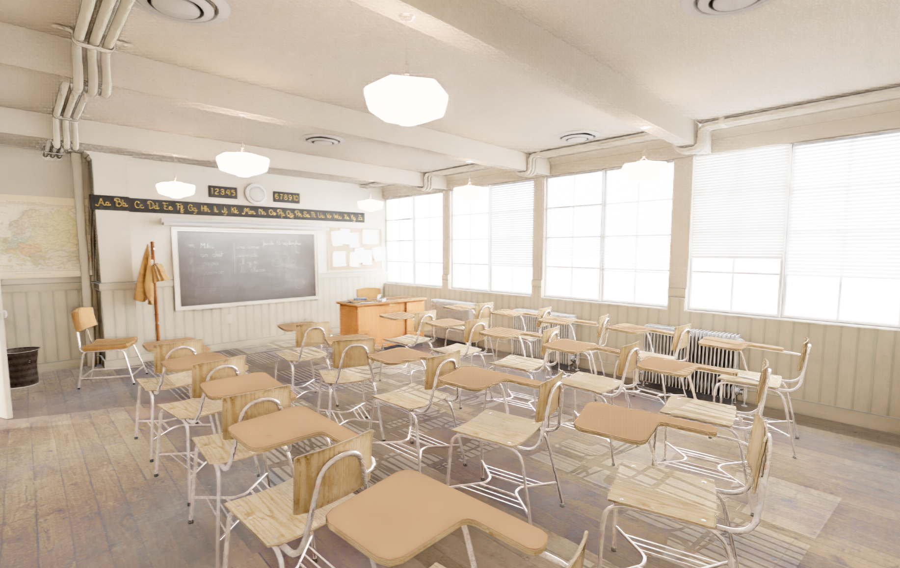

<p align="center">
  
</p>

Real-time Vulkan path tracing renderer for Blender. Hardware-accelerated ray tracing with NVIDIA DLSS Ray Reconstruction for production-quality denoising at 30-60 FPS.

<p align="center">
  
</p>

   

## Features

### Path Tracing
- **Hardware RT** with Vulkan ray query (RTX cores)
- **Configurable bounces** (1-8) with separate glass bounce budget (16)
- **Multi-SPP** (1-128 samples per pixel per frame)
- **GGX microfacet BRDF** (Cook-Torrance) with importance sampling
- **Cycles-style glass** (GGX refraction, Fresnel, rough glass)
- **Stochastic transparency** (Transparent BSDF passthrough, alpha cutout)
- **Multiple Importance Sampling** for emissive triangle NEE
- **Russian Roulette** with perceptual sqrt weighting

### Denoising & Upscaling
- **DLSS Ray Reconstruction** — neural denoiser that replaces traditional denoising + upscaling in one pass (all RTX GPUs)
- **NRD ReLAX + SIGMA** fallback — temporal denoiser for diffuse/specular + shadow denoiser
- **DLSS Super Resolution** — temporal upscaling (Ultra Performance to DLAA)
- **Auto-exposure** with GPU histogram and EMA smoothing

### Blender Integration
- **Native viewport render engine** (no external windows)
- **Blender 5.0+** with extension system support
- **Staged loading** with animated loading screen
- **Per-frame sync** for transforms, lights, materials
- **Material support**: Principled BSDF, Diffuse, Glossy, Glass, Transparent, Emission, Mix Shader, Add Shader
- **Shader node evaluation**: ColorRamp, MixRGB, Math, Gamma, Invert, Bright/Contrast, Hue/Sat, Clamp, Map Range
- **Alpha cutout** from texture (fence, wireframe, leaf materials)
- **Bump-to-roughness** conversion for frosted glass at low SPP
- **Backface culling** toggle
- **Reload Scene** button for manual refresh

### Sky & Lighting
- **Procedural sky** with Preetham/Rayleigh+Mie atmospheric scattering
- **Physically correct GI** — no fake ambient, all illumination from ray bounces
- **Sun + point/spot/area lights** with soft shadows
- **Emissive materials** with MIS light sampling

## Requirements

- **GPU**: NVIDIA RTX series (RTX 20/30/40/50 — hardware ray tracing required)
- **OS**: Windows 10/11
- **Blender**: 5.0+ (GPU backend must be **OpenGL**: Edit > Preferences > System > GPU Backend)
- **Build tools**: CMake 3.20+, Visual Studio 2022, Vulkan SDK 1.3+

## Install (Addon)

Download `ignis_rt_addon.zip` from [Releases](https://github.com/kalexis1994/ignis-rt/releases) and install in Blender:

1. Edit > Preferences > Add-ons > Install from Disk > select zip
2. Enable "Ignis RT"
3. Set render engine to **Ignis RT**
4. Viewport Shading > Rendered (or Z > Rendered)

## Building from Source

```bash
cmake -S . -B build
cmake --build build --config Release
```

### Deploy to Blender

```powershell
.\deploy_blender.ps1              # Build + deploy to latest Blender
.\deploy_blender.ps1 -NoBuild     # Skip build, just copy files
.\deploy_blender.ps1 -Symlink     # Dev mode (Python changes are instant)
```

## Project Structure

```
ignis-rt/
  include/           # Public headers (C API, config, NRD/DLSS)
  src/vk/            # Vulkan core (context, renderer, RT pipeline, interop)
  shaders/
    include/          # Shared GLSL (BRDF, sampling, sky, tonemapping)
    raygen_blender.rgen  # Main path tracer
    wavefront/        # Compute-based wavefront kernels
  blender/ignis_rt/   # Blender addon (Python)
```

## Known Limitations

- Specular reflections can shimmer during camera motion (converges when static)
- No volumetrics (fog, SSS) yet
- No procedural textures on GPU (Noise, Voronoi — use constant color fallback)
- DLAA mode may show noise (RR works best with upscaling)

## Contributing

Contributions welcome! Areas where help is especially valuable:
- Procedural texture GPU implementation
- Volumetrics / subsurface scattering
- Incremental scene updates (add/remove objects without full reload)
- Additional Blender shader node support

## License

[GNU General Public License v3.0](LICENSE)
