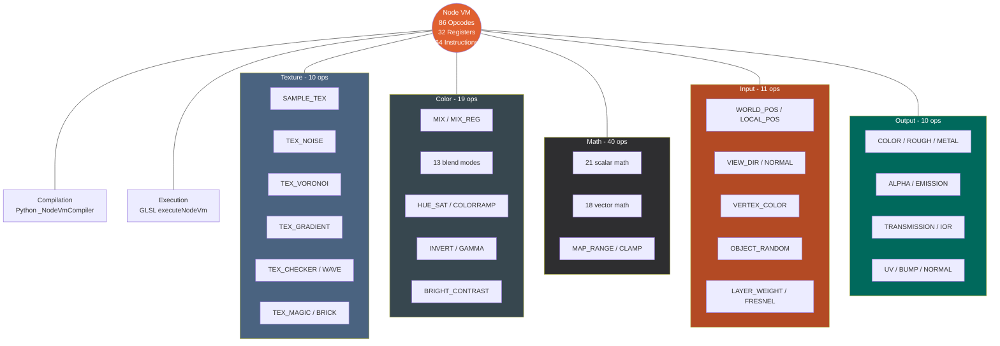
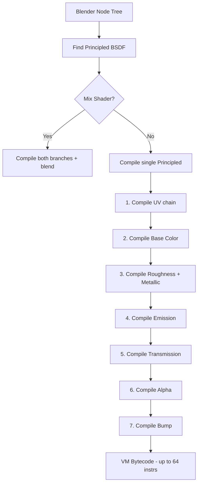

# Node VM

The Node VM is a bytecode interpreter that runs inside the raygen shader, evaluating Blender's shader node tree per-pixel. It replaces the need for generating unique shaders per material.

## Architecture



## Instruction Format

Each instruction is a `uvec4` (16 bytes):

```
┌───────────────────────┬─────────┬─────────┬─────────┐
│         .x            │  .y     │  .z     │  .w     │
├───────────────────────┼─────────┼─────────┼─────────┤
│ opcode  (bits 0-7)    │ imm_y   │ imm_z   │ imm_w   │
│ dst     (bits 8-12)   │ (32bit) │ (32bit) │ (32bit) │
│ srcA    (bits 16-20)  │         │         │         │
│ srcB    (bits 24-28)  │         │         │         │
└───────────────────────┴─────────┴─────────┴─────────┘
```

- **opcode** (bits 0-7): Operation to perform
- **dst** (bits 8-12): Destination register (0-31, 5-bit encoding)
- **srcA** (bits 16-20): Source register A
- **srcB** (bits 24-28): Source register B
- **imm_y/z/w**: Immediate values (float or uint via `uintBitsToFloat`)

## Register Allocation

- **R[0]**: UV coordinates (default, shared by all texture lookups)
- **R[1-31]**: General purpose, allocated sequentially by the compiler
- **Cache**: `node_reg_cache` maps `(node_type, node_name, socket_id)` → register, preventing re-compilation of nodes with multiple outputs

## Compilation Flow



## Limitations

| Aspect | Limit | Notes |
|--------|-------|-------|
| Instructions | 64 max | Complex materials may exceed; compilation stops silently |
| Registers | 32 max | Shared across all node chains |
| RGB Curves | Passthrough only | Baked LUT produces blue tint; needs OCIO pipeline investigation |
| Combine RGB | Not compiled | Handled as passthrough or special-case UV optimization |
| Bump node | TEX_NOISE only | Other procedural textures not supported as bump height source |
| Texture sampling | 1 UV set | All textures share the same compiled UV transform |

## Noise Implementation

Uses Cycles' exact algorithms for matching procedural textures:

- **Hash**: Jenkins Lookup3 (`hash_uint3` from Cycles `util/hash.h`)
- **Gradient**: Perlin improved noise branchless `grad3` (from Cycles `svm/noise.h`)
- **Fade**: Quintic Hermite `t³(6t²-15t+10)`
- **FBM**: Multi-octave with configurable detail, roughness, lacunarity
