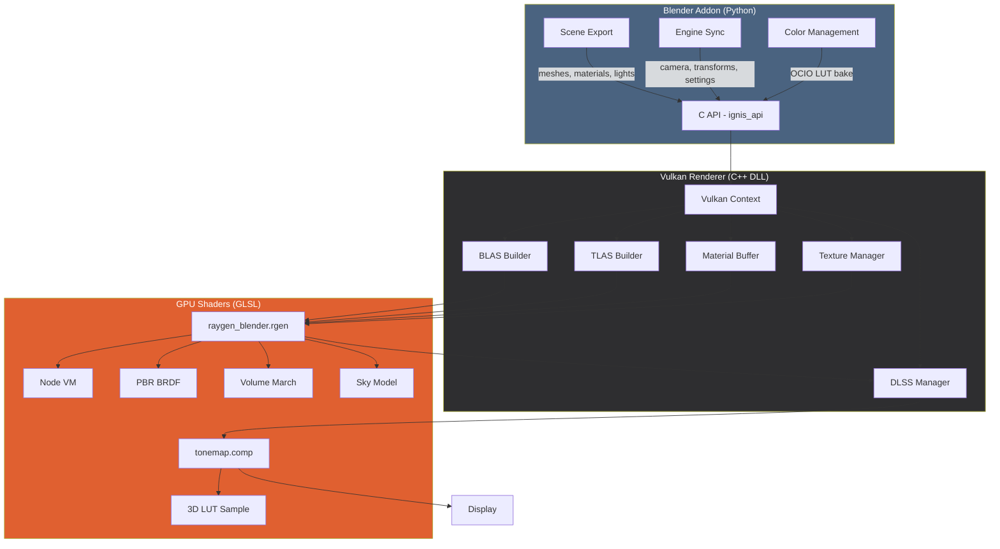
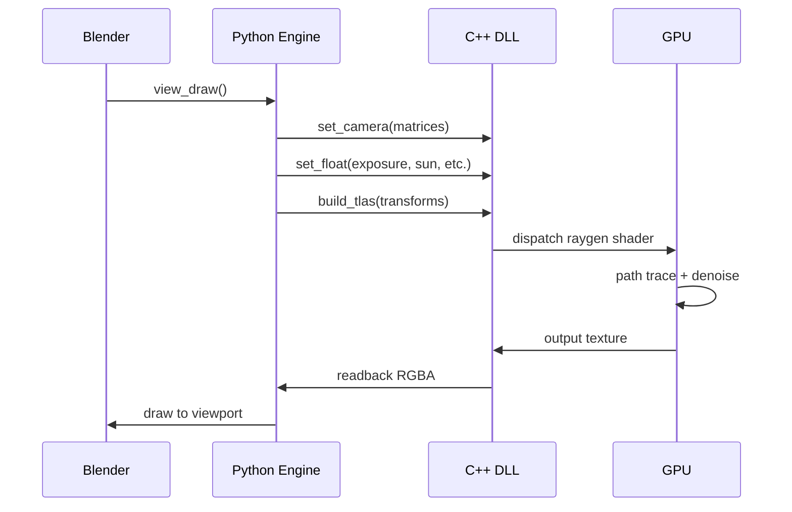

# Architecture Overview

Ignis RT is structured in three layers: the **Blender Addon** (Python), the **Vulkan Renderer** (C++/DLL), and the **Shader System** (GLSL).

## Data Flow

### Initial Load (Staged)

| Stage | What | Duration |
|-------|------|----------|
| 1. Export | Python reads Blender scene → meshes, materials, textures | ~1-3s |
| 2. BLAS | Upload vertex/index buffers, build per-mesh BVH | ~2-5s |
| 3. Materials | Compile Node VM bytecode, upload material buffer | ~1-2s |
| 4. Textures | Decode images, upload to GPU (chunked) | ~2-10s |
| 5. TLAS | Build top-level acceleration structure (instances) | <0.1s |
| 6. Finalize | Sun extraction, emissive triangles, HDRI | <0.5s |

### Per-Frame Sync

## Key Design Decisions

### Node VM vs Native Shaders

Instead of generating a unique shader per material (like Cycles), Ignis RT uses a **bytecode interpreter** (Node VM) that runs inside the raygen shader. This avoids shader recompilation when materials change.

| Approach | Pros | Cons |
|----------|------|------|
| **Node VM** (ours) | No recompile on material change, hot-reload | Slightly slower per-pixel, 64 instruction limit |
| **Generated shaders** (Cycles) | Maximum performance, no instruction limit | Minutes to compile, can't hot-reload |

### DLSS Ray Reconstruction vs NRD

Ray Reconstruction replaces the traditional NRD denoiser with an AI model that understands ray-traced signals. Benefits:

- Better temporal stability
- Fewer ghosting artifacts
- Handles noisy path-traced input better (transformer architecture)
- Single DLL, no NRD build dependency

### Alpha Transparency

All rays use `gl_RayFlagsOpaqueEXT` for maximum hardware BVH performance. Alpha-tested materials (Mix Shader with Transparent BSDF) use stochastic pass-through in the bounce loop — `rand() > alpha` decides whether the ray continues through or shades the surface. Back faces of alpha-tested meshes are not culled, allowing visibility through 3D wireframe/foliage meshes.

### Performance Optimizations

| Optimization | Impact | GPU |
|---|---|---|
| **Shader Execution Reordering (SER)** | Reduces thread divergence by grouping threads with same material | RTX 40+ hardware, 30 software |
| **VM skip for empty programs** | Avoids function call + 20-field struct init when instrCount=0 | All |
| **Output opcode fast-path** | Opcodes >= 0xE0 branch directly to output handlers, skipping 50+ intermediate checks | All |
| **Opaque ray queries** | Hardware BVH finds closest hit natively, no per-candidate processing | All |
| **Runtime OCIO LUT bake** | Single 3D texture lookup for any view transform, no per-pixel OCIO evaluation | All |
