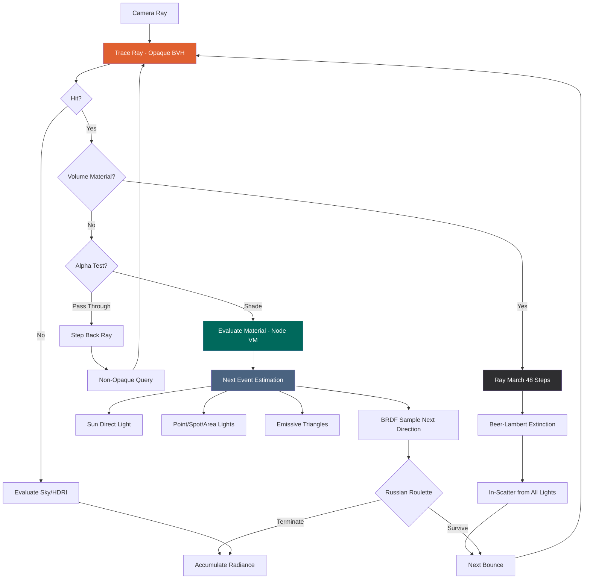
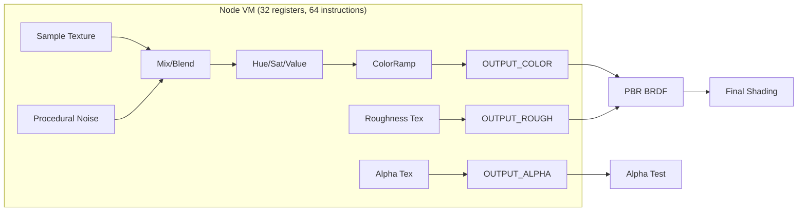
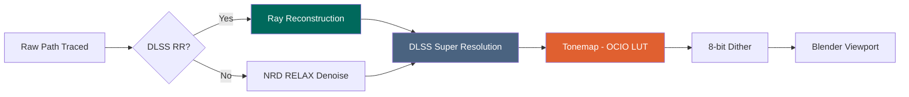

# Render Pipeline

## Path Tracing Loop

Each pixel traces a ray through multiple bounces, accumulating lighting contributions:

## Material Evaluation

The Node VM evaluates Blender's shader node tree per-pixel:

## Denoising & Display

## Supported Blender Nodes

| Category | Nodes | Status |
|----------|-------|--------|
| **BSDF** | Principled, Diffuse, Glossy, Transparent, Glass | Full |
| **Shader** | Mix Shader, Add Shader | Full (per-pixel blend) |
| **Texture** | Image, Noise, Voronoi, Gradient, Wave, Checker, Magic, Brick, White Noise | Full |
| **Color** | Mix (13 blend modes), ColorRamp, Hue/Sat/Value, Bright/Contrast, Invert, Gamma | Full |
| **Color** | RGB Curves | Passthrough (not evaluated) |
| **Math** | Math (21 ops), Vector Math (18 ops), Map Range, Clamp | Full |
| **Channel** | Separate RGB/XYZ | Full |
| **Channel** | Combine RGB/XYZ | Passthrough (special-case UV only) |
| **Input** | Texture Coordinate (UV, Object, Generated), Object Info (Random), Vertex Color | Full |
| **Input** | Geometry (Position, Normal, Incoming, Backfacing), Layer Weight, Fresnel | Full |
| **Input** | Light Path | Simplified (Is Camera Ray = 1, rest = 0) |
| **Vector** | Mapping (2D UV + 3D position), Normal Map | Full |
| **Vector** | Bump | TEX_NOISE height only |
| **Volume** | Volume Scatter, Principled Volume, Volume Absorption | Ray March (48 steps) |
| **Utility** | Reroute, Frame, Value, RGB | Full |
