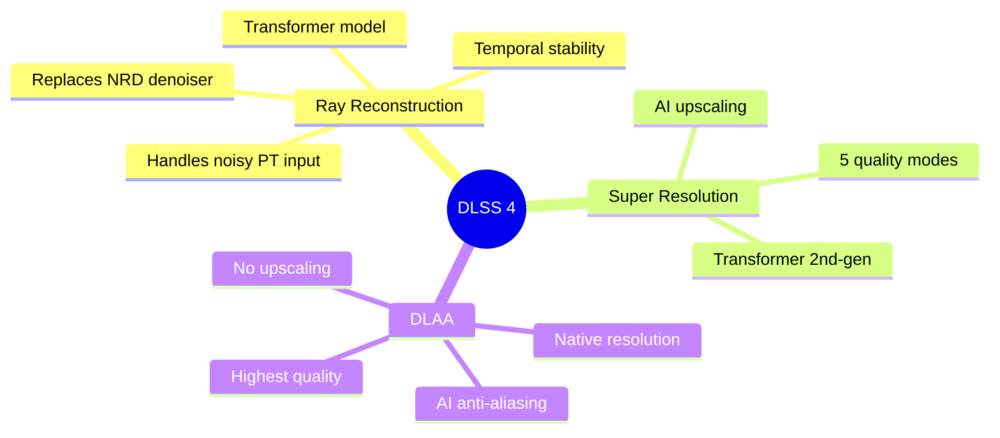
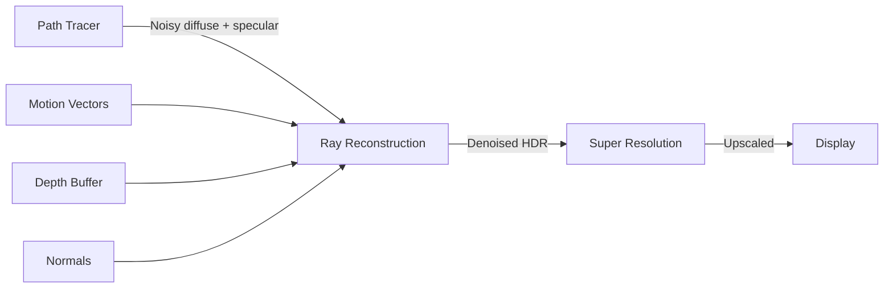

# DLSS Integration

Ignis RT uses NVIDIA DLSS 4 (SDK v310.5.3) for denoising, upscaling, and anti-aliasing.

## Features

## Quality Modes

| Mode | Upscale | Use Case |
|------|---------|----------|
| Ultra Performance | 3.0x | Maximum FPS |
| Performance | 2.0x | High FPS |
| Balanced | 1.7x | Balance quality/perf |
| Quality | 1.5x | High quality (default) |
| Ultra Quality | 1.3x | Near-native |
| **DLAA** | **1.0x** | **Native res, AI AA only** |

## Ray Reconstruction

DLSS Ray Reconstruction replaces traditional denoisers (NRD) with an AI model that understands ray-traced signals:

### Pipeline

### Inputs Required

| Buffer | Format | Source |
|--------|--------|--------|
| Diffuse Radiance | RGBA16F | Path tracer (NRD-packed) |
| Specular Radiance | RGBA16F | Path tracer (NRD-packed) |
| Motion Vectors | RG16F | Per-pixel screen-space MV |
| Depth | R32F | View-space linear depth |
| Normals | RGBA16F | World-space normals |

## GPU Compatibility

| Feature | RTX 20 | RTX 30 | RTX 40 | RTX 50 | Ignis RT |
|---------|--------|--------|--------|--------|----------|
| Super Resolution | Yes | Yes | Yes | Yes | Implemented |
| Ray Reconstruction | Yes | Yes | Yes | Yes | Implemented |
| DLAA | Yes | Yes | Yes | Yes | Implemented |
| Frame Generation | — | — | Yes | Yes | Not implemented |
| Multi Frame Gen | — | — | — | Yes | Not implemented |

!!! note "Performance on RTX 30"
    The DLSS 4 transformer model uses more Tensor Core compute than the older CNN model. RTX 30 series lacks FP8 support, resulting in ~20% higher cost compared to RTX 40/50.

!!! warning "Frame Generation"
    DLSS Frame Generation and Multi Frame Generation are **not implemented** in Ignis RT. These require integration via the [Streamline SDK](https://github.com/NVIDIA-RTX/Streamline), which is a separate effort. Currently only Super Resolution, Ray Reconstruction, and DLAA are available.
