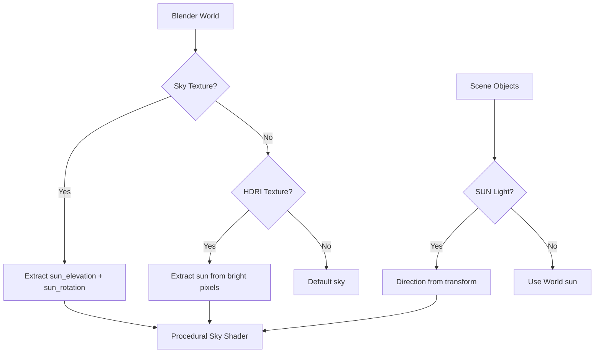
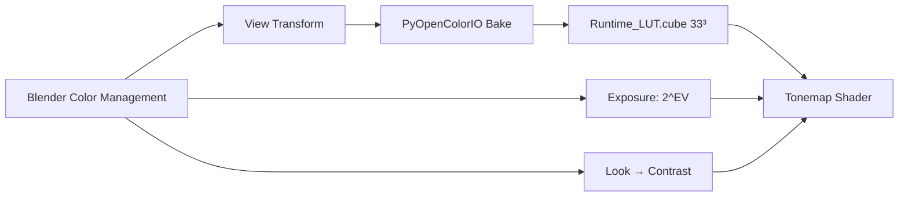

# Lighting

## Light Sources

### Sun / Sky Texture

Automatically detected from Blender's World settings:

1. **SUN light object** — direction from transform, intensity = energy × π
2. **Sky Texture (Nishita/Hosek)** — sun direction from elevation/rotation using Cycles' exact formula
3. **HDRI environment** — sun extracted from brightest pixels

### Point / Spot / Area Lights

Up to 32 lights with Next Event Estimation:

| Type | Attenuation | Special |
|------|-------------|---------|
| Point | 1/r² + windowed falloff | — |
| Spot | 1/r² + cone + smoothstep | Cone angle + blend |
| Area | 1/r² × facing × area | Size from transform scale |

### Emissive Triangles

Materials with Emission Color are exported as emissive triangle lights for MIS (Multiple Importance Sampling). Up to 256 emissive triangles with CDF-based importance sampling.

## Color Management

Ignis RT reads Blender's Color Management settings automatically:

### Supported View Transforms

ALL Blender view transforms are supported via runtime OCIO LUT baking:

- AgX, Filmic, Standard, Raw
- ACES 1.3, ACES 2.0
- Khronos PBR Neutral
- False Color, Filmic Log

### Supported Display Devices

- sRGB, Display P3, Rec.1886, Rec.2020
