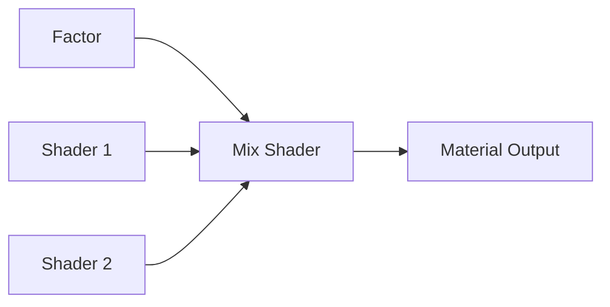
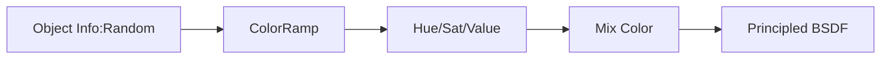

# Materials

Ignis RT supports Blender's Principled BSDF and common shader nodes through the Node VM bytecode compiler.

## Supported Material Types

### Principled BSDF
Full support for all commonly used inputs:

| Input | Support | Notes |
|-------|---------|-------|
| Base Color | Full | Texture, ColorRamp, Mix, procedural |
| Metallic | Full | Texture or constant |
| Roughness | Full | Texture or constant |
| Alpha | Full | Per-pixel from texture, stochastic cutout |
| Normal | Partial | Normal Map full; Bump only with Noise Texture height |
| Emission Color | Full | Texture or constant |
| Emission Strength | Full | Constant |
| Transmission Weight | Full | Per-pixel from texture/nodes |
| IOR | Full | Constant |
| Specular IOR Level | Full | Constant |

### Mix Shader
Per-pixel blending of two BSDF branches using `OP_MIX_REG`:



Supports:
- Principled + Principled blend
- Transparent + Principled (alpha cutout)
- Diffuse + Glossy blend
- Cross-Group compilation (nodes inside Groups)

### Transparent BSDF + Alpha

When Mix Shader combines Transparent BSDF with another shader:
- Factor is compiled as per-pixel alpha (`OP_OUTPUT_ALPHA`)
- Stochastic pass-through in bounce loop
- Hybrid ray query for coplanar decals (opaque main + non-opaque continuation)

### Add Shader
Principled + Emission: both contributions compiled, emission texture supported.

## PBR BRDF

### Dielectric Fresnel
Exact dielectric Fresnel equations matching Cycles' `bsdf_util.h`:

```glsl
float fresnel_dielectric(float cosi, float eta) {
    float c = abs(cosi);
    float g2 = eta * eta - 1.0 + c * c;
    if (g2 < 0.0) return 1.0; // total internal reflection
    float g = sqrt(g2);
    float A = (g - c) / (g + c);
    float B = (c * (g + c) - 1.0) / (c * (g - c) + 1.0);
    return 0.5 * A * A * (1.0 + B * B);
}
```

### GGX Specular
- VNDF sampling (Heitz 2018)
- Smith G2 geometry term
- F82-Tint for metals

## Object Info: Random

Per-instance variation using `hash(instanceId)`:



Each instance gets a unique random value [0,1] based on its TLAS instance ID, enabling material variation without duplicating materials.
