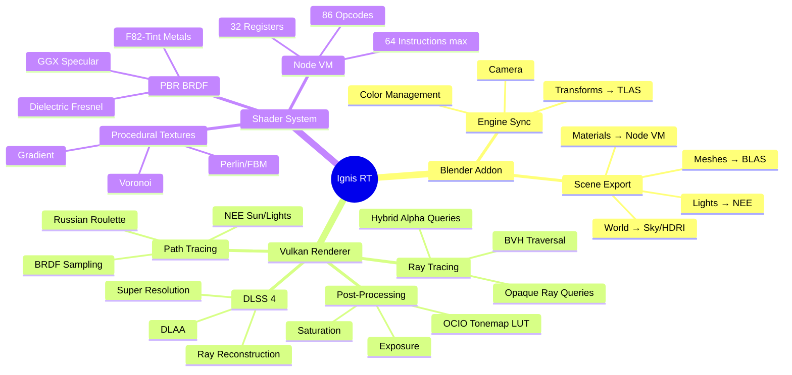
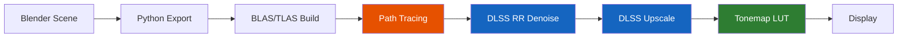

# Ignis RT

**Real-time Vulkan ray tracing path tracer for Blender**

Ignis RT is a viewport render engine for Blender that uses hardware-accelerated ray tracing (RTX) to produce physically-based renders in real-time. It aims to match Cycles' output quality while maintaining interactive frame rates.

## Key Features

- **Full path tracing** — multi-bounce GI with importance sampling
- **DLSS 4 integration** — Super Resolution, Ray Reconstruction, DLAA
- **Cycles-compatible materials** — Node VM evaluates Blender shader nodes per-pixel
- **Volumetric rendering** — ray marching with Beer-Lambert + Henyey-Greenstein
- **Blender Color Management** — runtime OCIO LUT bake for any view transform
- **Procedural textures** — Cycles-exact Perlin noise (Jenkins Lookup3 hash)

## Architecture at a Glance

## Render Pipeline

## Quick Start

1. Download the latest release from [GitHub Releases](https://github.com/kalexis1994/ignis-rt/releases)
2. In Blender: **Edit → Preferences → Add-ons → Install from Disk**
3. Select the downloaded `.zip` file
4. Set render engine to **Ignis RT**
5. Switch to **Rendered** viewport shading (Z → Rendered)

!!! info "Requirements"
    - NVIDIA RTX GPU (20/30/40/50 series)
    - Windows 10/11
    - Blender 4.0+
    - Latest NVIDIA drivers (560+)
